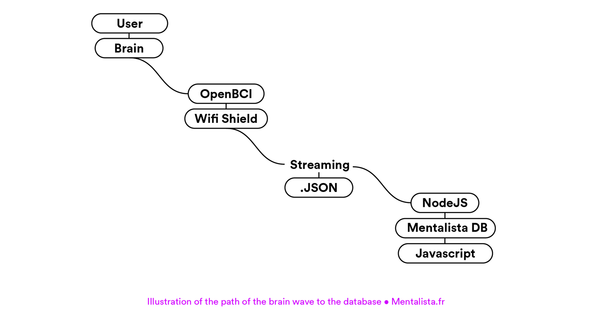

## 2.2.1.1 Standardisation d’un modèle d’envoi de données

Il n’existe pas encore de standardisation d'un format de données pour l’envoi de données cérébrales, il existe quelques [tentatives](https://github.com/NeuroJS/eeg-stream-data-model/issues/1) sur Internet qui rassemblent des scientifiques du monde entier mais cette standardisation n’est pas encore adoptée par tous les équipementiers qui capturent de l’EEG et d’autres données biologiques. L’objectif est de repartir de ses recherches pour approfondir et améliorer les dernières tentatives de standardisation et ainsi définir le format de données incluant les données cérébrales et leurs méta-données qui seront utilisées par la base de données.

###### Cahier des charges pour un format standard pour l’envoi de données cérébrales et biologiques :

Notre base de données est programmée en langage web mais les casques EEG sont programmés en C, en Java et en d’autres langages utilisés pour l’électronique. Il nous faut un format récent / portable / déjà utilisé sur le web et l’électronique. Le meilleur candidat est le format de description **.JSON** ([JavaScript Object Notation](https://fr.wikipedia.org/wiki/JavaScript_Object_Notation)).



Le fichier JSON doit encapsuler les différents standards. Ceux employés à l'échelle internationale utilisée par d'autres scientifiques et les standards propres à la structure de la base de données et ses futures applications.

Ce qui donne 4 entrées pour le fichier JSON :

- deux standardisés ("info", "biodata") en accord avec les besoins des scientifiques, qui sont respectivement les méta-données de la captation et les données cérébrales.
- deux  autres propres au besoin de chaque projet, la section "mentalista" décrivant les besoins de la base de données pour classifier le ficher et "app" les informations spécifiques à l’application qui a permis de recueillir ces données cérébrales.

```json
{
  "app": [],
  "mentalista": [],
  "info": [],
  "biodata": []
}
```

**info**: décrit les méta-données de la session d’enregistrement

```json
"info": [{	
  "id": null,
  "session_id": null,
  "created_at": 1497479774194733,
  
  "name": "undifined",
  "metric": "EEG",
  "type":"FFT", /*timeserie …*/
  
  "channel_count": 8, 
  "topology": [ "Pz", "Oz", "Cz", "C1", "FP1", "FP2", "F3", "F4"],
  "sampleRate": 2500, /*always in hz*/
  "unit": "millivolts",
  
  "version": "1.1",
  
  "source": {
   "name": "undefined",
   "size": "undefined",
   "type": "undefined"
  }
}],
```

**biodata**: décrit l’enregistrement des données en fonction du type, de la [topologie](https://en.wikipedia.org/wiki/10–20_system_(EEG)), d'un [timestamp](https://fr.wikipedia.org/wiki/Horodatage) et de l’unité.

L’exemple ici montre trois enregistrements cérébraux à 8 canaux avec chacun un timestamp leur donnant un repère temporel précis.

```json
"biodata": [
  { 
  	"value":[
      7.056745022195285,
      4.754953953750924,
      7.056745022195285,
      4.754953953750924, 
      7.056745022195285,
      4.754953953750924,
      7.056745022195285,
      4.754953953750924
  	],
  	"timestamp": 1503311302182
  },{
  	"value":[
      7.056745022195285,
      4.754953953750924,
      7.056745022195285,
      4.754953953750924, 
      7.056745022195285,
      4.754953953750924,
      7.056745022195285,
      4.754953953750924
  	],
  	"timestamp": 1503311310564
  },{ 
  	"value":[
      7.056745022195285,
      4.754953953750924,
      7.056745022195285,
      4.754953953750924, 
      7.056745022195285,
      4.754953953750924,
      7.056745022195285,
      4.754953953750924
  	],
    "timestamp": 1503311317143
  }
]
```

**mentalista**: héberge toutes les méta-données permettant de classifier l'enregistrement cérébral dans la base de données. Ansi que toutes les informations de la transaction utilisé pour sécuriser le fichier.

```json
"mentalista": [{ 
  "experience": "BrainLib",
  "block":13,
  
  "txHash":"0x16e41aa9d97d1c3374a4cb9599fedbd24d4b56",
  "block_timestamp":1497479774194925,
  "from":"0x19e03255f667bdfd50a",
  "to":"0x9c98e381edc fe1ac5149",
  "contract_type" : "Mentalista-smart-contract",
  
  "start_timestamp": 1497479774194733,
  "end_timestamp": 1497479774194733,
  
  "user": "user#4155",
  "context": "undefined",
  
  "place": "undefined",
  "long": 48.880169,
  "lat": 2.365573		
}]
```

**app**: indique toutes les données propres à l'expérience qui a permis de recueillir ces données.

Voici un exemple des applications qui peuvent recueillir des informations pour la base de données :

- [MentalistaFoot](http://mentalista.fr/foot)
- [Mentalista Guinguette](http://mentalista.fr/guinguette)
- [BrainSound](http://mentalista.fr/brainsound)
- [Projet Levitation](http://mentalista.fr/levitation)

L'exemple qui suit montre les méta-données pour la classification d'un objet par le cortex visuel, utilisées pour ceéer une libraire de pensées.

```json
"app": [{ 
  "experience":"Mentalista VisionAPI",
  "version": "1.2",
  
  "object":"Cat",
  "accuracy":0.92355632,
  "timestamp":1497479774194733,
  "singleObject": true,
  
  "localisation":[
  	{"x":183.76,"y":54.72},
  	{"x":21.62,"y":297.31},
  	{"x":208.59,"y":23.04},
  	{"x":825.64,"y":517.40}
  ],
  "img":"cat_1497479774194733.jpg"  
}]
```